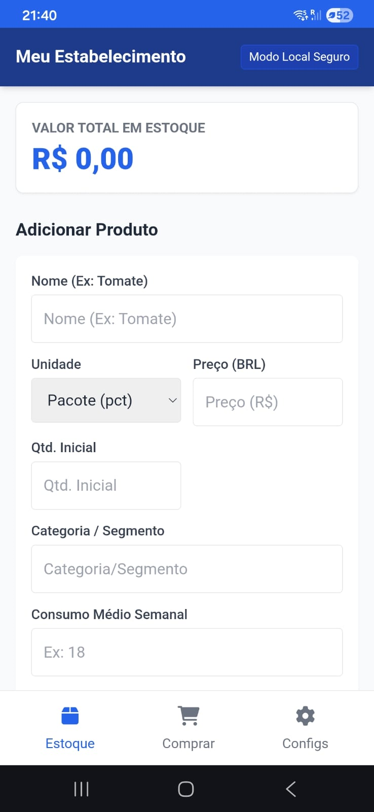
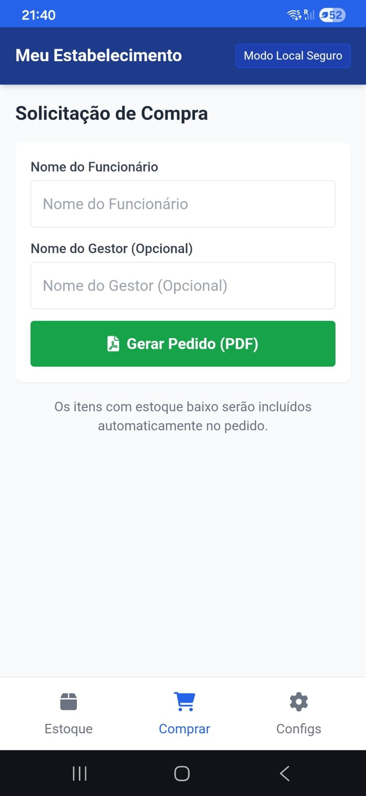
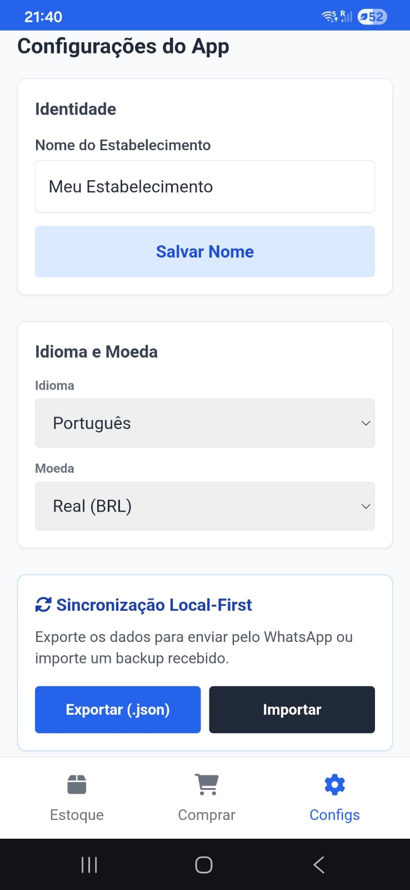

# Stock Control

Organizador de estoque offline-first para pequenos e médios estabelecimentos. Cadastre produtos, acompanhe o consumo e gere pedidos de compra em PDF sem depender de conexão com a internet.

## Offline-First

O Stock Control é um PWA (Progressive Web App): roda no navegador, mas se comporta como um aplicativo instalado, com armazenamento interno via `LocalStorage`. Todos os dados — produtos, quantidades, categorias e histórico de consumo — ficam salvos no próprio dispositivo, permitindo uso completo sem internet. A sincronização entre dispositivos é feita de forma local-first, exportando os dados em `.json` para envio manual (ex: WhatsApp) e importando o backup no outro dispositivo.

O sistema é multi-idioma e multi-moeda, configurável diretamente nas Configurações do App.

> **Em produção:** o Stock Control está atualmente em uso real em um estabelecimento em Basileia, Suíça, como gerenciador de estoque do negócio, facilitando o controle diário e a geração de pedidos de compra.

## Funcionalidades Principais

- **Gestão de Estoque** — cadastro de produtos por unidade, preço, quantidade e categoria/segmento, com organização intuitiva por tipo de produto e cálculo automático do valor total em estoque.
- **Pedidos de Compra em PDF** — geração de solicitação de compra em PDF, com itens de estoque baixo incluídos automaticamente na lista.
- **Cálculo Inteligente de Reposição** — lógica que estima a quantidade a ser comprada com base no consumo médio semanal, projetando a necessidade para um período de 7 dias.
- **Multiplataforma e Offline** — instalável como app em Windows, Android e iOS via PWA, funcionando integralmente sem conexão com a internet.
- **Central de Ajuda Integrada** — guia operacional e manual do sistema acessível diretamente no app, traduzido para 4 idiomas (Português, Inglês, Alemão e Italiano), garantindo suporte completo para equipes internacionais.

## Screenshots

**Abertura do App**

**Dashboard / Estoque**

**Solicitação de Compra**

**Configurações e Backup**

## Guia de Instalação (PWA)

O Stock Control não precisa ser baixado de nenhuma loja de aplicativos. A instalação é feita diretamente pelo navegador.

**Acesse:** [https://l1nq.com/stock-control](https://l1nq.com/stock-control)

### Chrome / Edge (Desktop)
1. Acesse o link do projeto.
2. Clique no ícone de instalação na barra de endereço (ou no menu **⋮ > Instalar app**).
3. Confirme a instalação. O app abrirá em janela própria, como um programa nativo.

### Android
1. Acesse o link do projeto pelo Chrome.
2. Toque no menu **⋮** e selecione **Adicionar à tela inicial** (ou aceite o banner de instalação automático).
3. Confirme. O ícone do Stock Control aparecerá junto aos demais apps.

### iOS (Safari)
1. Acesse o link do projeto pelo Safari.
2. Toque no ícone de **Compartilhar**.
3. Selecione **Adicionar à Tela de Início**.
4. Confirme o nome e toque em **Adicionar**.

## Arquitetura e Desenvolvimento
O **Stock Control** foi concebido com uma arquitetura *Offline-First*, focada em performance e independência de bibliotecas externas.

*   **Tecnologia:** Implementado puramente em **Vanilla JavaScript**, garantindo leveza, carregamento instantâneo e total controle sobre a performance no navegador.
*   **Design de Lógica:** A arquitetura do sistema e as regras de negócio foram desenhadas para garantir a integridade dos dados locais (via `LocalStorage`) sem dependência de back-end.
*   **AI-Assisted Engineering:** Este projeto foi desenvolvido através de um fluxo de trabalho de *AI-assisted pair programming*. A IA foi utilizada como ferramenta de suporte para o desenho da arquitetura, refatoração de código para padrões modernos, implementação de internacionalização (i18n) e testes de fluxos operacionais, permitindo uma entrega rápida e robusta de um software que já está em uso em ambiente de produção real.

## Tecnologias

- HTML
- CSS
- JavaScript
- Service Workers
- Internacionalização (i18n) — suporte nativo para múltiplos idiomas com interface dinâmica

## Contribuição / Issues

Encontrou um bug ou tem sugestão de melhoria? Abra uma issue na seção **Issues** do repositório no GitHub, descrevendo o problema encontrado ou a funcionalidade sugerida.

[https://l1nq.com/stock-control]